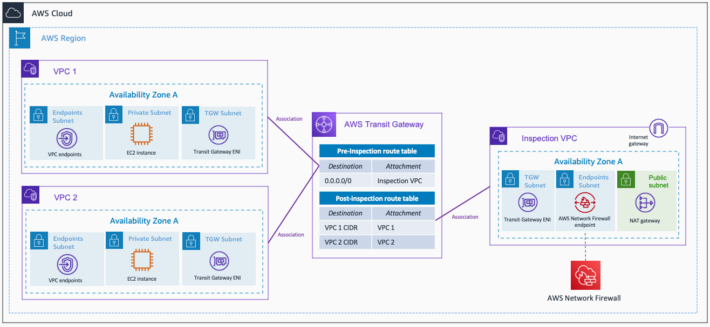
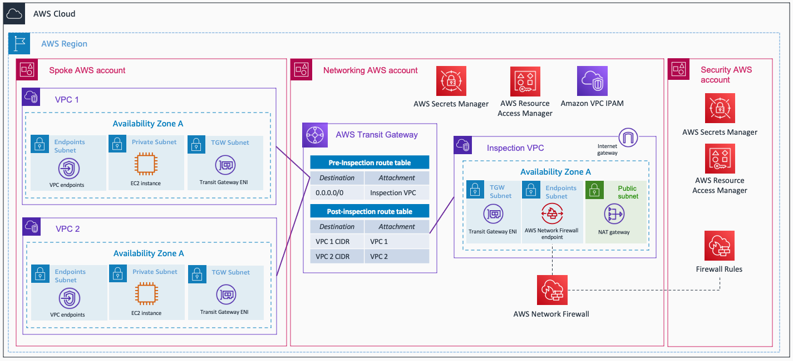

<!-- BEGIN_TF_DOCS -->
# AWS Hub and Spoke Architecture with an Inspection VPC - Terraform

This repository contains terraform code to deploy a sample AWS Hub and Spoke architecture with an Inspection VPC using AWS Network Firewall. The resources deployed and the architectural pattern they follow is purely for demonstration/testing purposes.

You will find two examples: the architecture built in a single AWS Account, and in a multi-Account environment.

* [Single AWS Account](./single-account/)

* [Multi-AWS Account](./multi-account/)

## Security

See [CONTRIBUTING](../CONTRIBUTING.md) for more information.

## License

This library is licensed under the MIT-0 License. See the [LICENSE](../LICENSE) file.