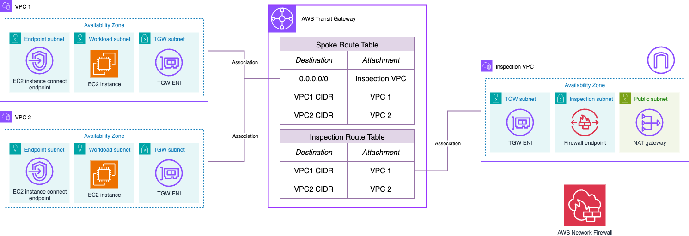

# AWS Hub and Spoke Architecture with an Inspection VPC - Single AWS Account

This repository contains terraform code to deploy a sample AWS Hub and Spoke architecture with an Inspection VPC using AWS Network Firewall. The resources deployed and the architectural pattern they follow is purely for demonstration/testing purposes. You can find two different examples:

1. [Centralized egress](./centralized_egress/), where there's a single Inspection VPC attached to the Transit Gateway with both AWS Network Firewall endpoints and NAT gateways. This pattern is also recommended when wanting to use the firewall both for egress and east-west traffic inspection.

2. [East-West](./east_west/), where we use the [native TGW attachment](https://docs.aws.amazon.com/network-firewall/latest/developerguide/tgw-firewall.html) in Network Firewall to reduce the operational overhead creating a central Inspection VPC.

## Infrastructure configuration

### AWS Network Firewall Policy

The AWS Network Firewall Policy is defined in the *policy.tf* file in the network_firewall module directory. The policy configuration will vary depending the example:

* All the SSH and RDP traffic is blocked by the Stateless engine.
* The Stateful engine follows Strict Rule Ordering.
  * For **centralized egress**, all traffic is blocked except HTTPS traffic to *aws.amazon.com*.
  * For **east-west**, all traffic is blocked except ICMP traffic between the spoke VPCs attached to the Transit Gateway.

### VPC Flow Logs configuration

This project configures both the alert and flow logs to respective AWS Cloudwatch Log Groups (both for the VPC Flow logs and AWS Network Firewall logs). In VPC Flow logs, you can also use Amazon S3. In Network Firewall, you can also use Amazon S3, or Amazon Kinesis Firehose.

To follow best practices, all the logs are encrypted at rest using AWS KMS. The KMS key (alongside the IAM roles needed) is created using the *iam\_kms* module.

## Security

See [CONTRIBUTING](../CONTRIBUTING.md) for more information.

## License

This library is licensed under the MIT-0 License. See the [LICENSE](../LICENSE) file.
