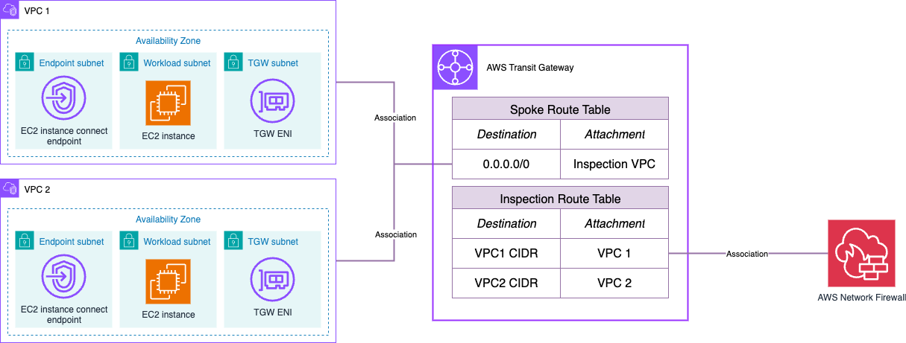

# AWS Hub and Spoke Architecture with an Inspection VPC - Single AWS Account (East-West)

## Prerequisites
* An AWS account with an IAM user with the appropriate permissions
* Terraform installed

## Code Principles:
* Writing DRY (Do No Repeat Yourself) code using a modular design pattern

## Usage
* Clone the repository
* Edit the variables.tf file in the project root directory. This file contains the information used to configure the Terraform code.

**Note** EC2 instances will be deployed in all the Availability Zones configured for each VPC, and AWS Network Firewall will be deployed in all the AWS Region's Availability Zones. Keep this in mind when testing this environment from a cost perspective - for production environments, we recommend the use of at least 2 AZs for high-availability.

## Target Architecture

## Deployment

* `terraform init` to initialize the environment.
* `terraform plan` to check the resources to create
* `terraform apply` to build the architecture.

## Clean-up

* `terraform destroy` will clean-up the resources created.